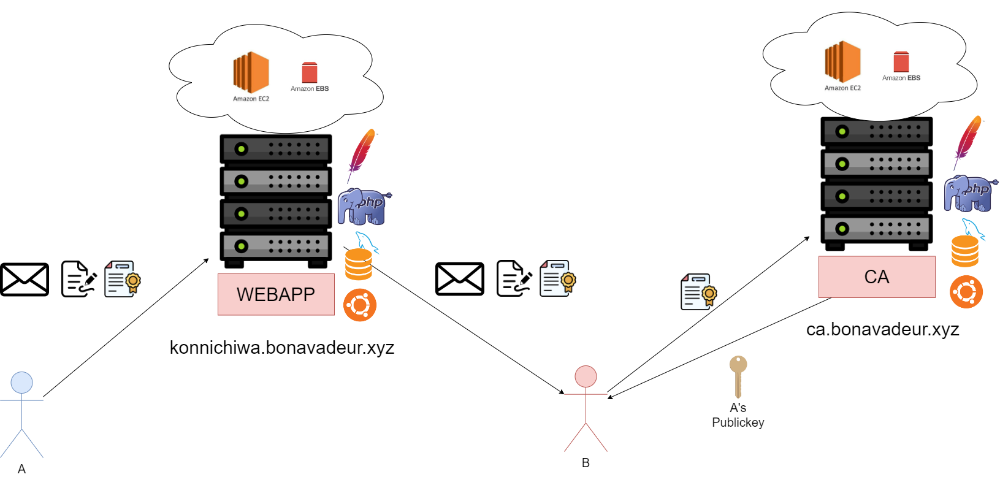
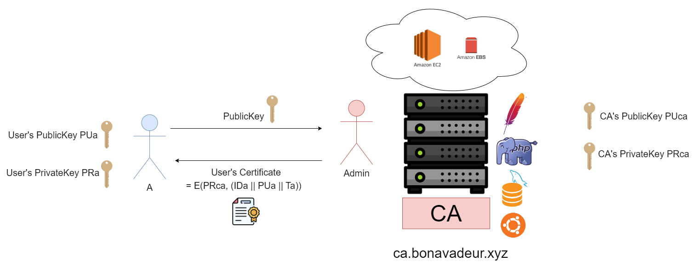
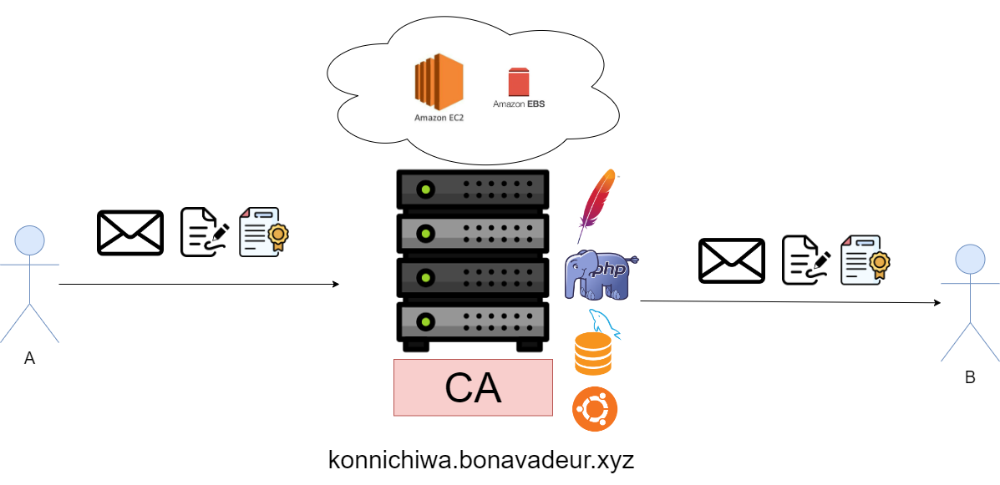

# Ứng dụng nhắn tin đơn giản có xác thực CA

### (Bài tập lớn môn Lí thuyết mật mã)

### 1. Mô hình hệ thống

### 2. Hệ thống CA

### 3. Ứng dụng nhắn tin trung gian Konnichiwa

### 4. Mã nguồn

Repo này chứa mã nguồn của 3 thành phần trên, được lưu trong 3 branches khác nhau

+ master: phần mềm client Konnichiwa
+ konnichiwa: Backend của ứng dụng nhắn tin Konnichiwa, sử dụng Framework Laravel
+ ca: Backend của hệ thống CA, sử dụng Framework Laravel